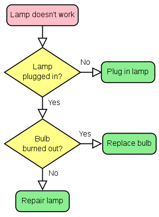
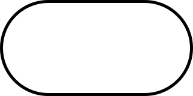
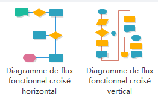
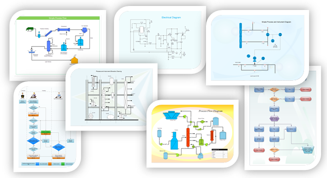
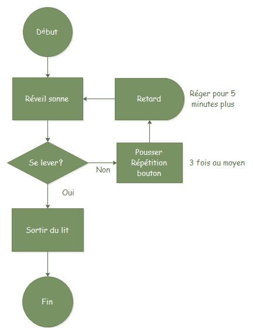
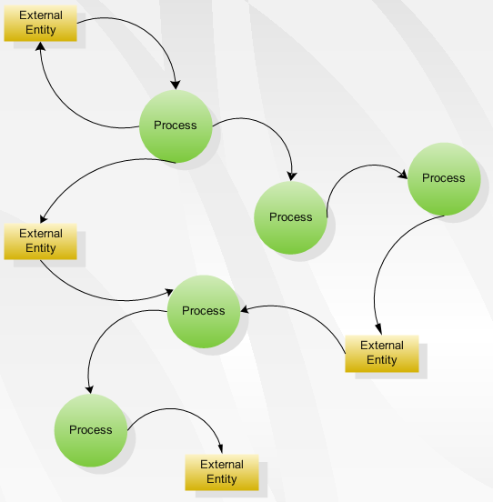
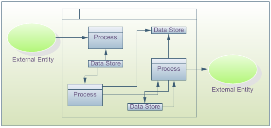

# Work on Flow Chart
## Définition
Le diagramme de flux est un moyen pour présenter visuellement le flux de données à travers un système de traitement d'informations, les opérations effectuées dans le système et la séquence dans laquelle elles sont effectuées. Dans cette leçon, nous allons nous intéresser au diagramme de flux de programme, qui décrit ce que les opérations (et dans quel ordre) sont nécessaires pour résoudre un problème donné.

<b>Le flux </b> est une représentation d'une série d'opérations logiques pour satisfaire des exigences spécifiques. Un flux existe naturellement. Il peut être irrégulière, non fixée ou plein de problèmes. Pour cette raison, il peut apparemment être absents dans certaines situations. Dernièrement, les membres d'une équipe ont été chargés d'enquêter sur le déroulement d'un processus d'affaires, et on m'a dit qu'il y avait des lacunes dans le flux. La réponse de la personne qui était en charge de l'équipe était qu'aucun flux a été montré dans le cadre du processus de l'entreprise. Comme une question de fait, il est impossible pour une entreprise, réalisée sans un flux. Il peut être un écoulement sous une forme non fixée, ou peut-être la personne elle-même qui vous étudié n'a pas une idée claire sur le flux.

<b>Le diagramme</b> est une présentation ou une description écrite de certaines parties régulières et ordinaires de la circulation. Un graphique est propice à la communication et de la concentration et offre des références pour la réingénierie des processus.

<table border="0">
  <tr>
    <td>
      
    </td>
  </tr>
</table>

## Types de diagramme de flux

### Diagramme de flux détaillé
Le diagramme de flux détaillé fournit une image détaillée d'un processus en cartographiant toutes les étapes et les activités qui se produisent dans le processus. Ce type de diagramme de flux indique les étapes ou les activités d'un processus et inclut des choses telles que les points de décision, les périodes d'attente, les tâches qui doivent souvent être refaites, et les boucles de rétroaction. Ce type de diagramme de flux est utile pour examiner les domaines du processus en détail et pour la recherche de problèmes ou les zones d'inefficacité. Par exemple, le diagramme de flux détaillé de l'enregistrement des patients révèle les retards qui se produisent lorsque le greffier d'enregistrement et responsable clinique ne sont pas disponibles pour aider les clients.

### Diagramme de flux de déploiement ou en matrice
Un diagramme de flux de déploiement trace le processus en termes de qui fait les étapes. Il est sous la forme d'une matrice, montrant les différents participants et le déroulement des étapes parmi ces participants. Il est surtout utile pour identifier qui fournit des intrants ou des services à qui, ainsi que les zones où les personnes différentes peuvent être inutilement font la même tâche.

## Symboles de diagramme de flux
<table border="0">
  <tr>
    <td>
      
    </td>
     <td>
       
Flowline : Shows the program's order of operation. A line coming from one symbol and ending at another.Arrowheads are added if the flow is not the standard top-to-bottom, left-to right.

    </td>
  </tr>
  <tr>
    <td>
      
    </td>
     <td>
       
Boîte arrondie - l'utiliser pour représenter un événement qui se produit automatiquement. Un tel événement va déclencher une action ultérieure, par exemple 'recevoir des appels téléphoniques', ou décrire un nouvel état de choses.

    </td>
  </tr>
   <tr>
    <td>
      
    </td>
     <td>
       
Losange - l'utiliser pour représenter un point de décision dans le processus. Typiquement, la déclaration dans le symbole, il faudra une réponse 'oui' ou 'non' et de la brancher à différentes parties de le diagramme de flux en conséquence.

    </td>
  </tr>
   <tr>
    <td>
      
    </td>
     <td>
       
Cercle - l'utiliser pour représenter un point où l'organigramme se connecte avec un autre processus. Le nom ou la référence pour l'autre processus devraient apparaître dans le symbole.

    </td>
  </tr>
</table>

## Exemples de diagrammes de flus et commentaires

### diagramme de flux fonctionnel croisé
Quand un diagramme de flux décrit un processus dans lequel un certain nombre de différents personnes, départements ou domaines fonctionnels sont impliqués, il est parfois difficile de garder la trace de quelle personne est responsable de chaque étape. Une technique supplémentaire utile pour le suivre et pour analyser le nombre de fois qu'un processus est «remis» à des personnes différentes, est de diviser l'organigramme en colonnes. Montez chaque colonne avec le nom de la personne ou de la fonction impliquée dans le processus. Et chaque fois qu'ils effectuent une action, le montre dans leur colonne. Ceci est illustré dans le diagramme de processus ci-après qui couvre un processus d'achat simple. Il montre comment le contrôle du processus passe de la personne à l'origine de l'achat au département d'achat, puis au fournisseur.
Les groupes représentent les unités fonctionnelles. Les formes représentant les étapes du processus sont placés dans des groupes correspondant aux unités fonctionnelles chargées de ces étapes.

<table border="0">
  <tr>
    <td>
      
    </td>
  </tr>
</table>

#### Analyse de diagramme de flux fonctionnel croisé

Un processus peut être une expérience enrichissante encore choquante. Le processus évolue généralement au fil du temps, et les changements et les conditions d'affaires. Il en résulte des couches inutiles de complexité et d'inspection. Votre première réaction est peut-être, " c'est vraiment ce que nous faisons?"

Votre deuxième réaction sera fixée au processus. Voici une liste de ce que vous devez rechercher: des mesures non-valeur ajoutée. Défiez chaque étape du processus. Vous vous demandez, "Quelle est la valeur de cette activité ajouter? Est-ce que notre client le fait attention? " Combiner, simplifier ou éliminer les activités qui ne contribuent pas à la valeur.

Points de contrôle excessifs. Les inspections et les approbations de superviseur n'ajoutent pas toujours le valeur. Ils évoluent principalement en raison d'un manque de confiance dans le processus. Éliminer les étapes de contrôle qui ne sont pas essentielles pour la qualité des résultats.

Transferts excessifs. Chaque fois que les activités du processus passent d'un joueur à l'autre, il ya des risques de retard ou d'une mauvaise communication. Essayez d'organiser le travail de telle sorte que chaque joueur devient de plus d'un généraliste et moins d'un spécialiste. Cela permettra de réduire la complexité des multiples transferts.

Spécialisation des tâches. Traitement de la ligne d'assemblage cède la place à des modèles cellulaires pour organiser des groupes de travail ou des équipes, à la fois sur le plancher de l'usine et des bureaux administratifs. L'information circule plus rapidement avec moins de distorsion, améliorant à la fois la qualité et la vitesse de travail. Il consolide les tâches lorsqu'il est possible.

### Diagramme de flux de processus

Diagramme de flux de processus est également connu comme le système de diagramme d'écoulement ou SFD. La raison principale de l'utilisation de diagramme de processus est de nous montrer la relation parmis les parties principales du système. Diagramme de flux de processus ne comprend pas les parties ou les composants mineures du système telles que les évaluations des tuyauteries. Dans de nombreuses organisations, les utilisateurs prennent les diagrammes de flux de processus comme la feuille de débit.

Diagramme de flux de processus est principalement utilisé dnas le domaine de l'ingénierie et de l'industrie chimique où il est nécessaire de représenter seulement les relations entre les principaux composants. Ce génie des procédés et de l'industrie chimique sont moins préoccupés par les composants mineurs impliqués dans le système. Les diagrammes de flux de processus pour l'unité unique ou plusieurs unités diffèrent dans leur structure et leur mise en œuvre. Les diagrammes de flux de processus pour plusieurs unités ne comprennent pas d'informations détaillées et ils sont connus comme les diagrammes de flux schématiques ou de diagrammes de flux de bloc.

<table border="0">
  <tr>
    <td>
      
    </td>
  </tr>
</table>

#### Exemple d'un diagramme de flux de processus
Cette figure suivante est un exemples d'un diagramme de flux très simple pour le processus de sortir du lit le matin
<table border="0">
  <tr>
    <td>
      
    </td>
  </tr>
</table>

### Diagramme de flux de données

Un diagramme de flux de données (DFD) est une technique de modélisation important pour l'analyse et la construction de processus d'information. DFD signifie littéralement une illustration qui explique le cours ou la circulation de l'information dans un processus. DFD illustre ce flux d'informations dans un processus basé sur les entrées et sorties. Un DFD peut être considéré comme un modèle de processus.

En outre, un DFD peut être utilisé pour visualiser le traitement de données ou un dessin structuré. Un DFD illustre des procédures de techniques ou d'affaires à l'aide de la boutique de données externe, des données découlant d'un processus à un autre, et des résultats.

#### Exemples de diagramme de flux de données

L'exemple suivant montre comment dessiner un diagramme de flux de données.

Avant qu'il ait finalement été remplacé, une machine de copie souffert bourrages papier fréquents et est devenu un fauteur de troubles notoire. Souvent, un problème pourrait être effacé en ouvrant simplement et fermer le panneau d'accès. Quelqu'un a observé la situation et a créé un diagramme de flux de la procédure de dépannage utilisé par la plupart des gens.

<table border="0">
  <tr>
    <td>
      
    </td>
  </tr>
</table>

#### Historique pour ce diagramme

Le DFD est un excellent outil de communication pour les analys aux processus de modèle et les exigences fonctionnelles. L'un des principaux outils des efforts d'analyse structurés dans les années 1970 a été développé et amélioré par les goûts de Yourdon, McMenamin, Palmer, Gane et Sarson. Il est toujours considéré comme l'un des meilleurs techniques de modélisation pour déclencher et représentant les exigences de traitement d'un système.

Utilisé efficacement, il est un outil de modélisation utile et facile à comprendre. Il a une vaste portée et la convivialité dans la plupart des projets de développement de logiciels. Il peut être facilement intégré à la modélisation des données, des outils de modélisation de flux de travail, et les spécifications textuelles.

Avec eux, il fournit aux analystes et aux développeurs des modèles solides et les spécifications. Seul, cependant, il a la facilité d'utilisation limitée. Il est simple et facile à comprendre pour les utilisateurs et peut être facilement étendu et affiné avec des spécifications ultérieures dans une version physique pour les équipes de conception et de développement.

#### Exemple de création d'un diagramme de flux de données

Diagrammes de flux de données peut être utilisé pour fournir une représentation claire de toute fonction d'affaires. La technique commence par une vue d'ensemble de l'entreprise et se poursuit par l'analyse de chacune des zones d'intérêt fonctionnel. Cette analyse peut être effectuée pour préciser le niveau de détail requis. La technique exploite une méthode appelée expansion de haut en bas pour effectuer l'analyse de manière ciblée.

<table border="0">
  <tr>
    <td>
      
    </td>
  </tr>
</table>

Le résultat est une série de diagrammes qui représentent les activités commerciales d'une manière qui est clair et facile à communiquer. Un modèle d'affaires comprend un ou plusieurs diagrammes de flux de données (également appelés diagrammes de processus métier). Au départ, un diagramme de contexte est tracé, qui est une représentation simple de l'ensemble du système à l'étude.

Il est suivi par un diagramme de niveau 1 qui donne un aperçu des principaux domaines fonctionnels de l'entreprise. Ne vous inquiétez pas sur les symboles à ce stade puisque ceux-ci seront expliquées sous peu. Utilisation du diagramme de contexte ainsi que des informations supplémentaires à partir de la zone d'intérêt, le niveau 1 diagramme peut être établi.

Le diagramme de niveau 1 identifie les principaux processus d'affaires à un niveau élevé et l'un de ces processus peut ensuite être analysé plus loin - donnant lieu à un niveau deux processus d'affaires schéma correspondant. Ce processus d'analyse plus détaillée peut alors continuer - à travers le niveau 3, 4 et ainsi de suite. Cependant, la plupart des enquêtes se arrêteront au niveau 2 et il est très rare d'aller au-delà d'un diagramme de niveau 3.

Identifier les processus d'affaires existants en utilisant une technique comme des diagrammes de flux de données est un précurseur essentiel de processus de réingénierie, la migration vers les nouvelles technologies, ou à l'amélioration d'un processus d'entreprise existante. Cependant, le niveau de détail requis dépendra du type de changement à l'étude.

Le modèle de processus est généralement utilisé dans l'analyse et la conception des méthodes structurées. Également appelé un diagramme de flux de données (DFD), elle montre le flux d'informations à travers un système. Chaque processus se transforme en sorties entrées.

## Sources
[1] - https://www.edrawsoft.com/fr/

[2] - https://fr.wikipedia.org/
